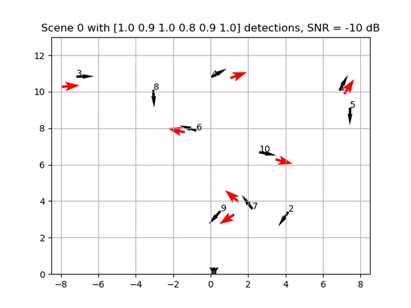

# SAGA (Spatial data association using Geometric Assistance)
This repository provides the demo code, Ipython notebooks to illustrate the application of SAGA algorithm for Multi-Sensor, Multi-target association of range-doppler measurements.
__Single snapshot imaging__ provides timely situational awareness, but can utilize neither platform motion, as in synthetic aperture radar, nor track targets across time, as in Kalman filtering and its variants. Associating measurements with targets becomes a fundamental bottleneck in this setting.
Our proposed algorithm provides a computationally efficient method for spatial association of single set of unordered range-doppler measurements from  a network of radar sensors. The algorithm is robust to detection anomalies at sensors and achieves order of magnitude lower complexity compared to conventional methods.
Demo examples are provided for illustration,

1. demo > association.ipynb provides an example of single shot association problem 
2. demo > association_sweep.ipynb evaluates performance of SAGA algorithm over different number of targets.
3. Further analysis scripts in the TSPsimpack folder evaluate the performance of core algorithm for different system setting e.g. number of sensors, targets, comparison with conventional algorithms such as Nearest neighbor and Min-cut Max flow. 

More details can be found in our paper: 

---
# Related Publications
1. A. Gupta, A. D. Sezer and U. Madhow, "[Multi-Sensor Spatial Association Using Joint Range-Doppler Features](https://ieeexplore.ieee.org/abstract/document/9568701)," in IEEE Transactions on Signal Processing, vol. 69, pp. 5756-5769, 2021, doi: 10.1109/TSP.2021.3119418.
2. A. Gupta, U. Madhow and A. Arbabian, ["Super-Resolution in Position and Velocity Estimation for Short-Range MM-Wave Radar"](https://wcsl.ece.ucsb.edu/sites/default/files/publications/asilomar16_final.pdf), 50th Asilomar Conference on Signals, Systems and Computers, Nov. 2016, Pacifc Grove, USA.

---

